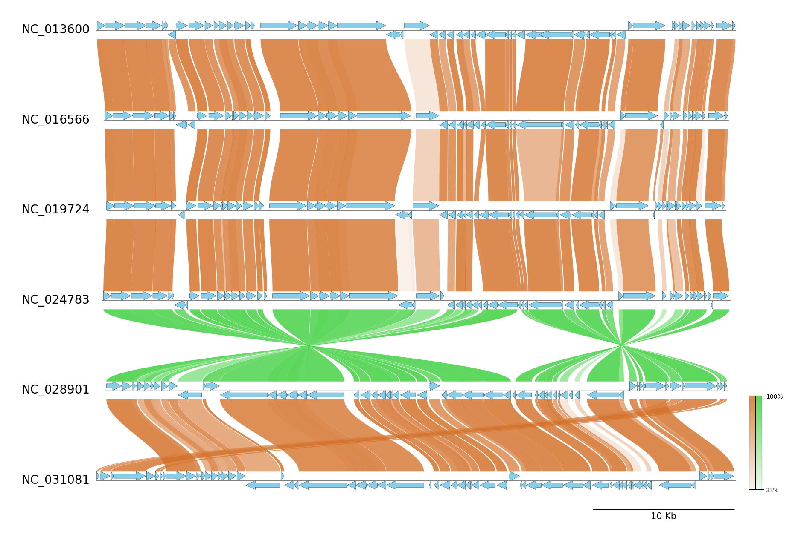
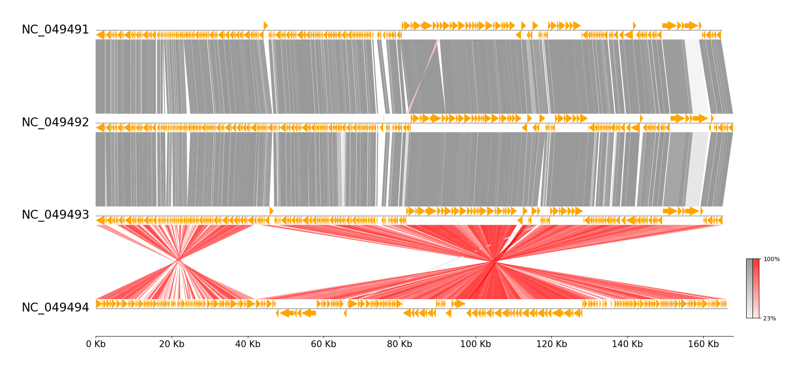
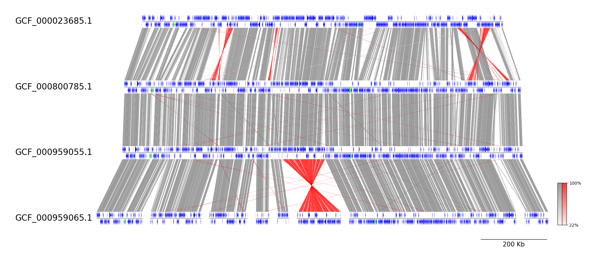

# pgv-mmseqs

`pgv-mmseqs` is one of the CLI workflows in pyGenomeViz for
visualization of homologous CDSs using MMseqs.
It can be used to visualize reciprocal best-hit CDSs between each genome.

## Installation

### Conda

    conda install -c conda-forge -c bioconda pygenomeviz mmseqs2

### Pip

    pip install pygenomeviz

Additional installation of MMseqs is required.
On Ubuntu22.04 or later, MMseqs can be installed with apt command.

    sudo apt install mmseqs2

### Docker

    docker run -it --rm -p 8501:8501 ghcr.io/moshi4/pygenomeviz:latest pgv-mmseqs -h

## Usage

    $ pgv-mmseqs --help
    usage: pgv-mmseqs [options] seq1.gbk seq2.gbk seq3.gbk -o outdir

    pyGenomeViz CLI workflow using MMseqs RBH method

    positional arguments:
      seqs                    Input genbank files

    General Options:
      -o , --outdir           Output directory
      --formats               Output image format ('png'[*],'jpg','svg','pdf',`html`[*])
      --reuse                 Reuse previous alignment result if available
      -q, --quiet             No print log on screen (default: OFF)
      -v, --version           Print version information
      -h, --help              Show this help message and exit

    MMseqs Alignment Options:
      --threads               Threads number (Default: MaxThread - 1)
      --length_thr            Length threshold to be plotted (Default: 0)
      --identity_thr          Identity threshold to be plotted (Default: 0)
      --evalue_thr            E-value threshold to be plotted (Default: 1e-03)

    Figure Appearence Options:
      --fig_width             Figure width (Default: 15)
      --fig_track_height      Figure track height (Default: 1.0)
      --track_align_type      Figure tracks align type ('left'|'center'[*]|'right')
      --feature_track_ratio   Feature track ratio (Default: 0.25)
      --show_scale_bar        Show scale bar (Default: OFF)
      --show_scale_xticks     Show scale xticks (Default: OFF)
      --curve                 Plot curved style link (Default: OFF)
      --dpi                   Figure DPI (Default: 300)
      --track_labelsize       Track label size (Default: 20)
      --scale_labelsize       Scale label size (Default: 15)
      --normal_link_color     Normal link color (Default: 'grey')
      --inverted_link_color   Inverted link color (Default: 'red')
      --segment_space         Track segment space ratio (Default: 0.02)
      --feature_type2color    Feature plot type & color (Default: ['CDS:orange'])
      --pseudo_color          Pseudo feature plot color (Default: 'lightgrey')
      --feature_plotstyle     Feature plot style ('[big]arrow'[*]|'[big]box'|'[big]rbox')
      --feature_linewidth     Feature line width (Default: 0.0)
      --feature_labeltrack    Feature label target track ('top'[*]|'all')
      --feature_labeltype     Feature label type ('product'|'gene'|'protein_id'|'None'[*])
      --feature_labelsize     Feature label size (Default: 8)
      --cbar_width            Colorbar width (Default: 0.01)
      --cbar_height           Colorbar height (Default: 0.2)

    [*] marker means the default value.

## Examples

### Example 1

Download example dataset:

    pgv-download acinetobacter_phage

Run CLI workflow:

    pgv-mmseqs NC_049491.gbk NC_049492.gbk NC_049493.gbk NC_049494.gbk \
               -o pgv-mmseqs_example1 --track_align_type left --show_scale_xticks

### Example 2

Download example dataset:

    pgv-download enterobacteria_phage

Run CLI workflow:

    pgv-mmseqs NC_013600.gbk NC_016566.gbk NC_019724.gbk NC_024783.gbk NC_028901.gbk NC_031081.gbk \
               -o pgv-mmseqs_example2 --show_scale_bar --curve --feature_linewidth 0.3 \
               --feature_type2color CDS:skyblue --normal_link_color chocolate --inverted_link_color limegreen

### Example 3

Download example dataset:

    pgv-download mycoplasma_mycoides

Run CLI workflow:

    pgv-mmseqs GCF_000023685.1.gbff GCF_000800785.1.gbff GCF_000959055.1.gbff GCF_000959065.1.gbff \
               -o pgv-mmseqs_example3 --show_scale_bar --feature_type2color CDS:blue rRNA:lime

