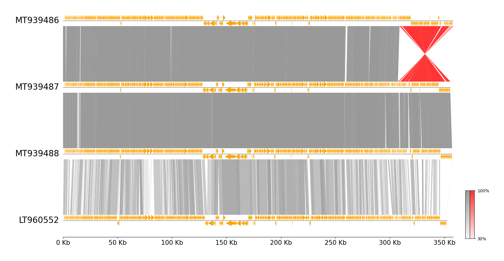
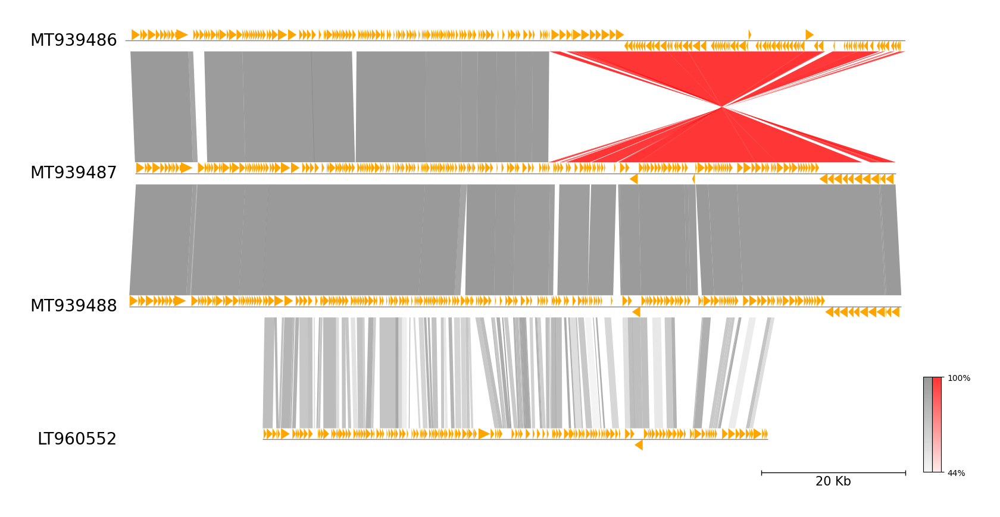
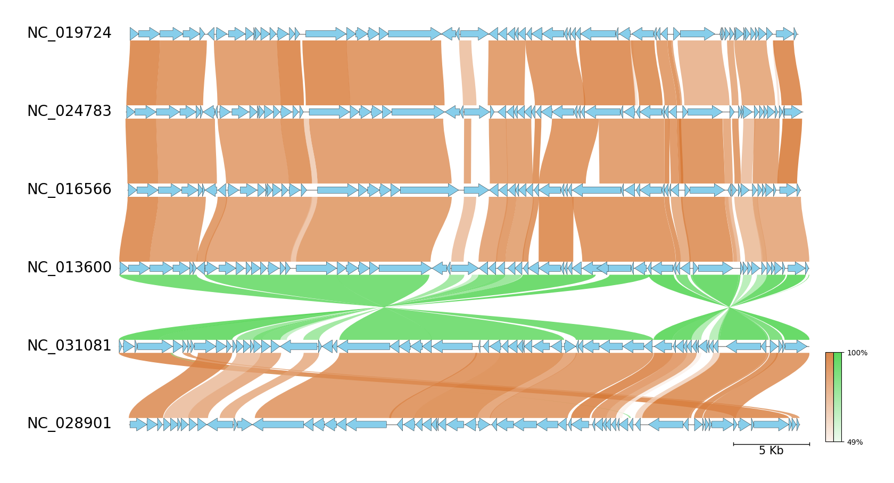

# pgv-mummer CLI Document

`pgv-mummer` is one of the CLI workflows in pyGenomeViz for
visualization of genome alignment using MUMmer.

## Installation

Additional installation of MUMmer is required.

### Conda

    conda install -c conda-forge -c bioconda pygenomeviz mummer

### Pip (Ubuntu)

    pip install pygenomeviz

In Ubuntu, MUMmer can be installed with apt command below.

    sudo apt install mummer

## Usage

### Basic Command

    pgv-mummer --gbk_resources seq1.gbk seq2.gbk seq3.gbk seq4.gbk -o mummer_example

### Options

    General Options:
      --gbk_resources IN [IN ...]  Input genome genbank file resources
                                   (Target range can be set as follows 'file:100-1000')
      -o OUT, --outdir OUT         Output directory
      --format  [ ...]             Output image format ('png'[*]|'jpg'|'svg'|'pdf'|`html`[*])
      --reuse                      Reuse previous result if available
      -v, --version                Print version information
      -h, --help                   Show this help message and exit

    MUMmer Alignment Options:
      --seqtype                    MUMmer alignment sequence type ('protein'[*]|'nucleotide')
      --min_length                 Min-length threshold to be plotted (Default: 0)
      --min_identity               Min-identity threshold to be plotted (Default: 0)
      -t , --thread_num            Threads number parameter (Default: MaxThread - 1)

    Figure Appearence Options:
      --fig_width                  Figure width (Default: 15)
      --fig_track_height           Figure track height (Default: 1.0)
      --feature_track_ratio        Feature track ratio (Default: 1.0)
      --link_track_ratio           Link track ratio (Default: 5.0)
      --tick_track_ratio           Tick track ratio (Default: 1.0)
      --track_labelsize            Track label size (Default: 20)
      --tick_labelsize             Tick label size (Default: 15)
      --normal_link_color          Normal link color (Default: 'grey')
      --inverted_link_color        Inverted link color (Default: 'red')
      --align_type                 Figure tracks align type ('left'|'center'[*]|'right')
      --tick_style                 Tick style ('bar'|'axis'|None[*])
      --feature_plotstyle          Feature plot style ('bigarrow'[*]|'arrow')
      --arrow_shaft_ratio          Feature arrow shaft ratio (Default: 0.5)
      --feature_color              Feature color (Default: 'orange')
      --feature_linewidth          Feature edge line width (Default: 0.0)
      --pseudo                     Show pseudogene feature
      --pseudo_color               Pseudogene feature color (Default: 'grey')
      --colorbar_width             Colorbar width (Default: 0.01)
      --colorbar_height            Colorbar height (Default: 0.2)
      --curve                      Plot curved style link (Default: OFF)
      --dpi                        Figure DPI (Default: 300)

    [*] marker means the default value.

## Examples

### Example 1

**Download example dataset:**

Download four *Erwinia phage* genbank files

    pgv-download-dataset -n erwinia_phage

**Run CLI workflow:**

    pgv-mummer --gbk_resources MT939486.gbk MT939487.gbk MT939488.gbk LT960552.gbk \
               -o mummer_example1 --tick_style axis --align_type left --feature_plotstyle arrow

<figure markdown>
  
  <figcaption>mummer_example1/result.png</figcaption>
</figure>

### Example 2

**Download example dataset:**

Download four *Erwinia phage* genbank files

    pgv-download-dataset -n erwinia_phage

**Run CLI workflow:**

> Target range is specified (e.g. file:100-1000)

    pgv-mummer --gbk_resources MT939486.gbk:250000-358115 MT939487.gbk:250000-355376 MT939488.gbk:250000-356948 LT960552.gbk:270000-340000 \
               -o mummer_example2 --tick_style bar --feature_plotstyle arrow

<figure markdown>
  
  <figcaption>mummer_example2/result.png</figcaption>
</figure>

### Example 3

**Download example dataset:**

Download six *Enterobacteria phage* genbank files

    pgv-download-dataset -n enterobacteria_phage

**Run CLI workflow:**

    pgv-mummer --gbk_resources NC_019724.gbk NC_024783.gbk NC_016566.gbk NC_013600.gbk NC_031081.gbk NC_028901.gbk \
               -o mummer_example3 --fig_track_height 0.7 --feature_linewidth 0.3 --tick_style bar --curve \
               --normal_link_color chocolate --inverted_link_color limegreen --feature_color skyblue

<figure markdown>
  
  <figcaption>mummer_example3/result.png</figcaption>
</figure>
