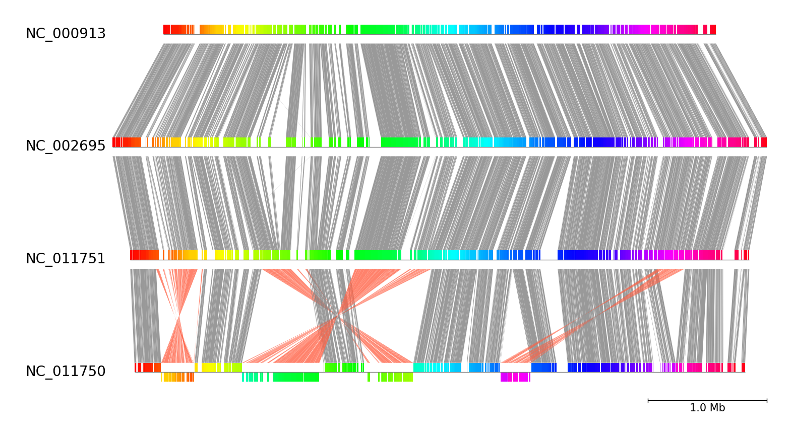
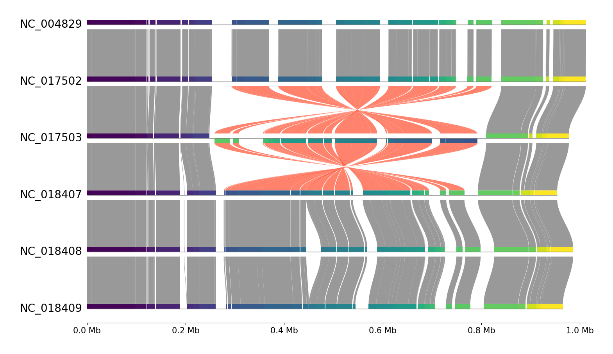

# pgv-pmauve CLI Document

`pgv-pmauve` is one of the CLI workflows in pyGenomeViz for
visualization of genome alignment results using progressiveMauve.
It can be used to visualize commonly conserved regions between all genomes.

## Installation

Additional installation of progressiveMauve is required.

### Conda

    conda install -c conda-forge -c bioconda pygenomeviz progressivemauve

### Pip (Ubuntu)

    pip install pygenomeviz

In Ubuntu, progressiveMauve can be installed with apt command below.

    sudo apt install progressivemauve

## Usage

### Basic Command

    pgv-pmauve --seq_files seq1.gbk seq2.gbk seq3.gbk seq4.gbk -o pmauve_example

### Options

    General Options:
      --seq_files IN [IN ...]  Input genome sequence files (Genbank or Fasta format)
      -o OUT, --outdir OUT     Output directory
      --refid                  Reference genome index (Default: 0)
      --format                 Output image format ('png'[*]|'jpg'|'svg'|'pdf')
      --reuse                  Reuse previous result if available
      -v, --version            Print version information
      -h, --help               Show this help message and exit

    Figure Appearence options:
      --fig_width              Figure width (Default: 15)
      --fig_track_height       Figure track height (Default: 1.0)
      --feature_track_ratio    Feature track ratio (Default: 1.0)
      --link_track_ratio       Link track ratio (Default: 5.0)
      --tick_track_ratio       Tick track ratio (Default: 1.0)
      --track_labelsize        Track label size (Default: 20)
      --tick_labelsize         Tick label size (Default: 15)
      --normal_link_color      Normal link color (Default: 'grey')
      --inverted_link_color    Inverted link color (Default: 'tomato')
      --align_type             Figure tracks align type ('left'|'center'[*]|'right')
      --tick_style             Tick style ('bar'|'axis'|None[*])
      --plotstyle              Block box plot style ('box'[*]|'bigbox')
      --cmap                   Block box colormap (Default: 'hsv')
      --curve                  Plot curved style link (Default: OFF)
      --dpi                    Figure DPI (Default: 300)

    [*] marker means the default value.

???+ question "Colormap(--cmap) option"

    User can arbitrarily choose the visualization colormap from 
    the various colormap types in matplotlib.  
    See [Choosing Colormaps in Matplotlib](https://matplotlib.org/stable/tutorials/colors/colormaps.html) for details.

## Examples

### Example 1

**Download example dataset:**

Download four *E.coli* genbank files

    pgv-download-dataset -n escherichia_coli

**Run CLI workflow:**

    pgv-pmauve --seq_files NC_000913.gbk NC_002695.gbk NC_011751.gbk NC_011750.gbk \
               -o pmauve_example1 --tick_style bar

<figure markdown>
  
  <figcaption>pmauve_example1/result.png</figcaption>
</figure>

### Example 2

**Download example dataset:**

Download six *M.gallisepticum* genbank files

    pgv-download-dataset -n mycoplasma_gallisepticum

**Run CLI workflow:**

    pgv-pmauve --seq_files NC_004829.gbk NC_017502.gbk NC_017503.gbk NC_018407.gbk NC_018408.gbk NC_018409.gbk \
               -o pmauve_example2 --fig_track_height 0.7 --align_type left --cmap viridis --tick_style axis --curve

<figure markdown>
  
  <figcaption>pmauve_example2/result.png</figcaption>
</figure>
