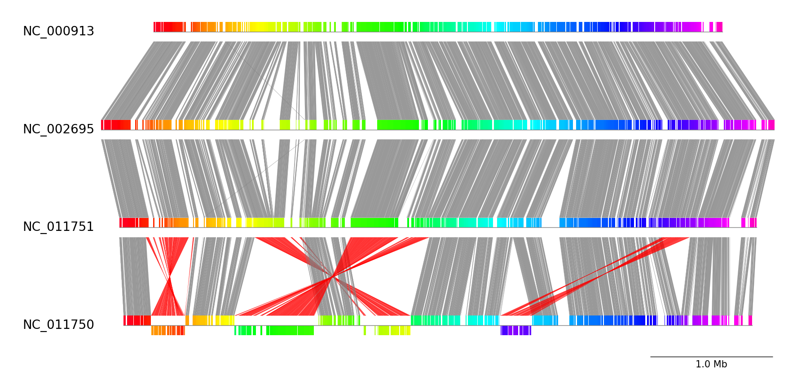
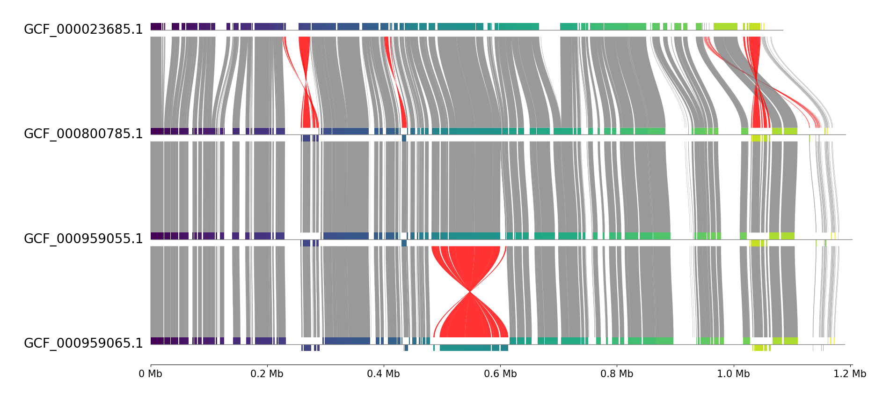

# pgv-pmauve

`pgv-pmauve` is one of the CLI workflows in pyGenomeViz for
visualization of genome alignment results using progressiveMauve.
It can be used to visualize commonly conserved regions between all genomes.

## Installation

### Conda

    conda install -c conda-forge -c bioconda pygenomeviz progressivemauve

### Pip

    pip install pygenomeviz

Additional installation of progressiveMauve is required.
On Ubuntu, progressiveMauve can be installed with apt command.

    sudo apt install progressivemauve

### Docker

    docker run -it --rm -p 8501:8501 ghcr.io/moshi4/pygenomeviz:latest pgv-pmauve -h

## Usage

    $ pgv-pmauve --help
    usage: pgv-pmauve [options] seq1.gbk seq2.gbk seq3.gbk -o outdir

    pyGenomeViz CLI workflow using progressiveMauve

    positional arguments:
      seqs                    Input genbank or fasta files

    General Options:
      -o , --outdir           Output directory
      --formats               Output image format ('png'[*],'jpg','svg','pdf',`html`[*])
      --reuse                 Reuse previous alignment result if available
      -q, --quiet             No print log on screen (default: OFF)
      -v, --version           Print version information
      -h, --help              Show this help message and exit

    Figure Appearence Options:
      --fig_width             Figure width (Default: 15)
      --fig_track_height      Figure track height (Default: 1.0)
      --track_align_type      Figure tracks align type ('left'|'center'[*]|'right')
      --feature_track_ratio   Feature track ratio (Default: 0.25)
      --show_scale_bar        Show scale bar (Default: OFF)
      --show_scale_xticks     Show scale xticks (Default: OFF)
      --curve                 Plot curved style link (Default: OFF)
      --dpi                   Figure DPI (Default: 300)
      --track_labelsize       Track label size (Default: 20)
      --scale_labelsize       Scale label size (Default: 15)
      --normal_link_color     Normal link color (Default: 'grey')
      --inverted_link_color   Inverted link color (Default: 'red')
      --refid                 Reference genome index (Default: 0)
      --block_plotstyle       Synteny block plot style ('box'[*]|'bigbox')
      --block_cmap            Synteny block colormap (Default: 'gist_rainbow')

    [*] marker means the default value.

!!! warning "Multi Contigs Input Case"

    progressiveMauve cannot align for multiple contigs. 
    Therefore, when multiple contigs are included in the input, 
    a sequence that concatenates the multiple contigs into one is used as the input.

!!! question "Colormap(--block_cmap) Option"

    User can arbitrarily choose the visualization colormap from 
    the various colormap types in matplotlib.  
    See [Choosing Colormaps in Matplotlib](https://matplotlib.org/stable/tutorials/colors/colormaps.html) for details.

## Examples

### Example 1

Download example dataset:

    pgv-download escherichia_coli

Run CLI workflow:

    pgv-pmauve NC_000913.gbk.gz NC_002695.gbk.gz NC_011751.gbk.gz NC_011750.gbk.gz \
               -o pgv-pmauve_example1 --show_scale_bar

### Example 2

Download example dataset:

    pgv-download mycoplasma_mycoides

Run CLI workflow:

    pgv-pmauve GCF_000023685.1.gbff GCF_000800785.1.gbff GCF_000959055.1.gbff GCF_000959065.1.gbff \
               -o pgv-pmauve_example2 --feature_track_ratio 0.15 --block_cmap viridis --track_align_type left \
               --show_scale_xticks --curve 

