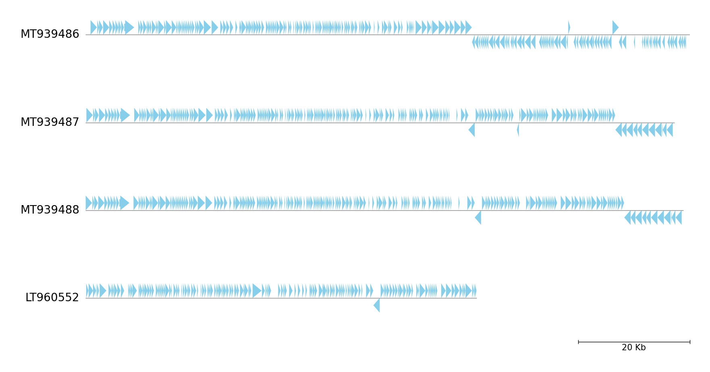

# pgv-simpleplot CLI Document

`pgv-simpleplot` is one of the CLI workflows in pyGenomeViz for simple genome visualization.

## Usage

### Basic Command

    pgv-simpleplot --gbk_resources seq1.gbk seq2.gbk seq3.gbk seq4.gbk -o result.html

### Options

    General Options:
      --gbk_resources IN [IN ...]  Input genome genbank file resources
                                   (Target range can be set as follows 'file:100-1000')
      -o OUT, --outfile OUT        Output file ('*.png'|'*.jpg'|'*.svg'|'*.pdf'|'*.html')
      -v, --version                Print version information
      -h, --help                   Show this help message and exit

    Figure Appearence Options:
      --fig_width                  Figure width (Default: 15)
      --fig_track_height           Figure track height (Default: 1.0)
      --feature_track_ratio        Feature track ratio (Default: 1.0)
      --space_track_ratio          Space (b/w feature) track ratio (Default: 2.0)
      --tick_track_ratio           Tick track ratio (Default: 1.0)
      --track_labelsize            Track label size (Default: 20)
      --tick_labelsize             Tick label size (Default: 15)
      --align_type                 Figure tracks align type ('left'[*]|'center'|'right')
      --tick_style                 Tick style ('bar'|'axis'|None[*])
      --feature_plotstyle          Feature plot style ('bigarrow'[*]|'arrow')
      --arrow_shaft_ratio          Feature arrow shaft ratio (Default: 0.5)
      --feature_color              Feature color (Default: 'orange')
      --feature_linewidth          Feature edge line width (Default: 0.0)
      --dpi                        Figure DPI (Default: 300)

    [*] marker means the default value.

## Examples

### Example 1

**Download example dataset:**

Download four *Enterobacteria phage* genbank files

    pgv-download-dataset -n enterobacteria_phage

**Run CLI workflow:**

    pgv-simpleplot --gbk_resources NC_019724.gbk -o simpleplot_example1.png

<figure markdown>
  
  <figcaption>simpleplot_example1.png</figcaption>
</figure>

### Example 2

Download six *Enterobacteria phage* genbank files

    pgv-download-dataset -n enterobacteria_phage

**Run CLI workflow:**

    pgv-simpleplot --gbk_resources NC_019724.gbk NC_024783.gbk NC_016566.gbk NC_013600.gbk NC_031081.gbk NC_028901.gbk \
                   -o simpleplot_example2.png --tick_style axis --feature_plotstyle arrow --fig_track_height 0.7

<figure markdown>
  
  <figcaption>simpleplot_example2.png</figcaption>
</figure>

### Example 3

**Download example dataset:**

Download four *Erwinia phage* genbank files

    pgv-download-dataset -n erwinia_phage

**Run CLI workflow:**

> Target range is specified (e.g. file:100-1000)

    pgv-simpleplot --gbk_resources MT939486.gbk:250000-358115 MT939487.gbk:250000-355376 MT939488.gbk:250000-356948 LT960552.gbk:270000-340000 \
                   -o simpleplot_example3.png --tick_style bar --feature_plotstyle arrow --feature_color skyblue

<figure markdown>
  
  <figcaption>simpleplot_example3.png</figcaption>
</figure>
