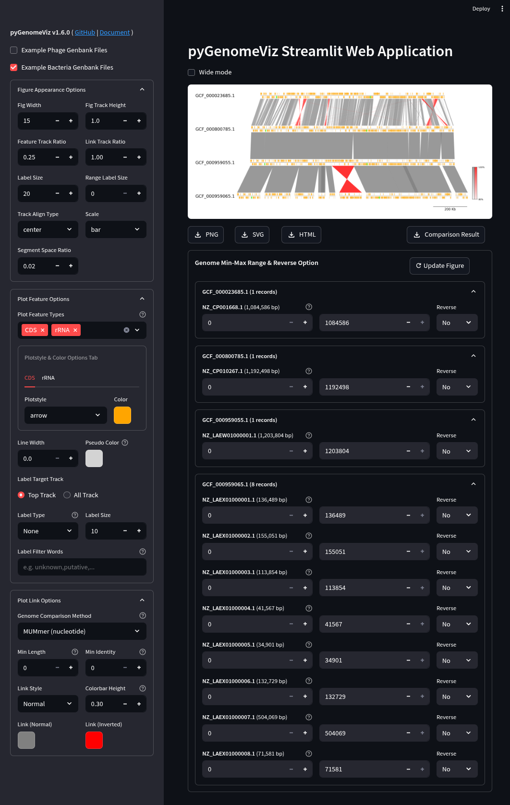

# pgv-gui

`pgv-gui` command is used to launch the pyGenomeViz Web Application.
It is developed with the streamlit web application framework,
and users can easily visualize the genomic features of Genbank files and their comparison results with GUI.

<figure markdown>
  
  <figcaption>
    pyGenomeViz web application example (<a href="https://pygenomeviz.streamlit.app">Demo Page</a>)
  </figcaption>
</figure>

## Installation

Additional installation of [streamlit](https://github.com/streamlit/streamlit) is required.
BLAST, MUMmer, MMseqs are also required to enable the genome comparison functionality.

### Conda

    conda install -c conda-forge -c bioconda pygenomeviz streamlit blast mummer mmseqs2

### Pip

    pip install pygenomeviz[gui]

On Ubuntu22.04 or later, BLAST, MUMmer, MMseqs can be installed with apt command.

    sudo apt install ncbi-blast+ mummer mmseqs2

### Docker

    docker run -it --rm -p 8501:8501 ghcr.io/moshi4/pygenomeviz:latest pgv-gui

## Usage

    $ pgv-gui --help
    usage: pgv-gui [options]

    pyGenomeViz CLI for launching Streamlit Web Application

    Users can access the web app with http://localhost:8501 (default).

    optional arguments:
      -p , --port    Port number to open web browser (Default: 8501)
      -v, --version  Print version information
      -h, --help     Show this help message and exit

!!! info
    By uploading a user Genbank file with a browser, a visualization figure of each genomic feature is automatically displayed.
    By setting each widget value, user can interactively change the appearance of the figure, genome comparison method, etc.

