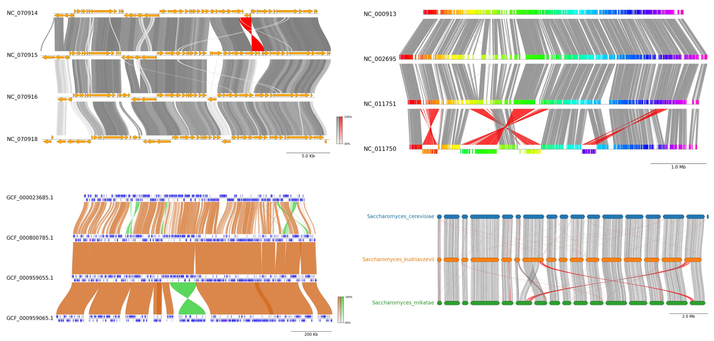
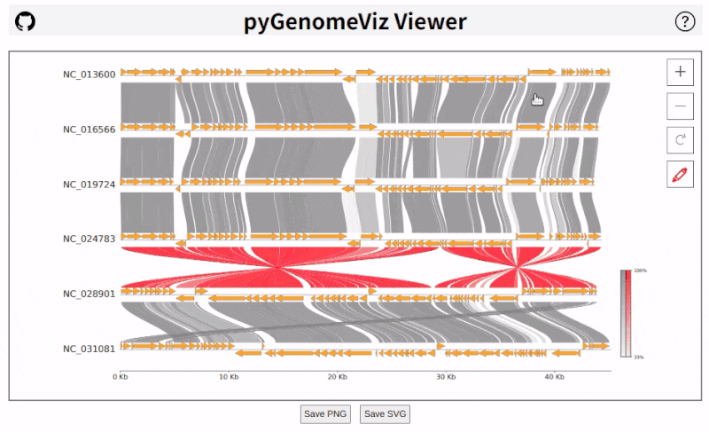

# pyGenomeViz

  

!!! info "Major Version Upgrade v1.0.0"

    A major version upgrade, pyGenomeViz **v1.0.0**, was released on 2024/05.
    Backward incompatible changes have been made between v1.0.0 and v0.X.X to make for a more sophisticated API/CLI design.
    Therefore, v0.X.X users should pin the version to v0.4.4 or update existing code for v1.0.0.
    Previous v0.4.4 documentation is available [here](https://moshi4.github.io/docs/pygenomeviz/v0.4.4/).

## Overview

pyGenomeViz is a genome visualization python package for comparative genomics implemented based on matplotlib.
This package is developed for the purpose of easily and beautifully plotting genomic
features and sequence similarity comparison links between multiple genomes.
It supports genome visualization of Genbank/GFF format file and can be saved figure in various formats (JPG/PNG/SVG/PDF/HTML).
User can use pyGenomeViz for interactive genome visualization figure plotting on jupyter notebook,
or automatic genome visualization figure plotting in genome analysis scripts/pipelines.

<figure markdown>
  
  <figcaption>pyGenomeViz example plot gallery</figcaption>
</figure>

<figure markdown>
  
  <figcaption>
    Interactive HTML Viewer (<a href="./images/pgv-viewer_demo1.html">Demo Page1</a>, <a href="./images/pgv-viewer_demo2.html">Demo Page2</a>)
  </figcaption>
</figure>

<figure markdown>
  
  <figcaption>
    pyGenomeViz web application example (<a href="https://pygenomeviz.streamlit.app">Demo Page</a>)
  </figcaption>
</figure>

## Installation

`Python 3.8 or later` is required for installation.

**Install PyPI package:**

    pip install pygenomeviz

**Install conda-forge package:**

    conda install -c conda-forge pygenomeviz

**Use Docker ([Image Registry](https://github.com/moshi4/pyGenomeViz/pkgs/container/pygenomeviz)):**

    docker run -it --rm -p 8501:8501 ghcr.io/moshi4/pygenomeviz:latest pgv-gui -h
